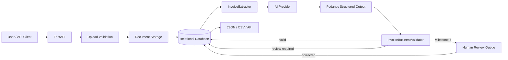

# Architecture

## System flow



## Milestone 4 validation boundary

```text
STORED DOCUMENT
      ↓
AI extraction
      ↓
Pydantic structural validation
      ↓
InvoiceBusinessValidator
      ├── no issues -> review_required=false -> document status: validated
      └── issues    -> review_required=true  -> document status: review_required
      ↓
Extraction row stores candidate + structured validation errors
```

## Responsibility boundaries

| Component | Responsibility |
|---|---|
| Document API | Upload and retrieve safe document metadata |
| Storage service | Sanitize names, validate type, enforce size, persist bytes |
| Extraction API | Coordinate extraction, validation, persistence, workflow status, and HTTP errors |
| InvoiceExtractor | Encode the stored file, call the provider, require structured output, retry transient failures |
| Extraction Pydantic schema | Define exactly what structurally valid invoice output looks like |
| InvoiceBusinessValidator | Apply deterministic arithmetic, required-field, date, currency, and confidence rules |
| Database | Preserve documents, AI candidate data, line items, validation errors, review flags, and status |
| Human review | Milestone 5: correct review-required extractions without losing the original AI result |

## Structural validation vs business validation

These layers answer different questions.

### Structural validation

Pydantic answers: **Is this data shaped correctly?**

Examples:

- `invoice_date` parses as a real date;
- `confidence` is between 0 and 1;
- numeric values are non-negative;
- line items contain the expected fields;
- unexpected keys are rejected.

### Business validation

`InvoiceBusinessValidator` answers: **Does this structurally valid invoice make sense under our operating rules?**

Examples:

- required auto-accept fields are present;
- `subtotal + tax ≈ total`;
- line-item amounts reconcile to the subtotal;
- line-item quantity and unit price reconcile to amount;
- currency is a known transactional ISO 4217 code;
- due date is not earlier than invoice date;
- confidence meets the configured threshold.

A payload can pass structural validation and still require human review.

## Why validation errors are structured

Validation failures are stored as objects with fields such as:

```text
code
field
message
observed
expected
```

This is more useful than one concatenated error string because later code can filter, count, display, and analyze individual failure reasons. Milestone 5 can render these reasons directly in the human review queue.

## Monetary comparisons

Money is not compared with raw binary floating-point equality. Extracted numeric values are converted to `Decimal` and compared using `AMOUNT_TOLERANCE`.

```text
abs(expected - observed) <= tolerance
```

This allows harmless rounding differences while still catching material inconsistencies.

## Workflow state

```text
uploaded -> extracting -> validated
                      \
                       -> review_required
                      \
                       -> extraction_failed
```

`extraction_failed` means the system could not obtain valid structured candidate data. `review_required` means extraction succeeded, but deterministic rules found reasons a human should inspect it. Those are deliberately different failure classes.
