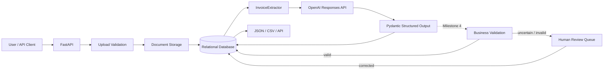

# Architecture

## System flow



## Milestone 3 extraction boundary

```text
STORED DOCUMENT                     PROVIDER BOUNDARY                     APPLICATION DATA

PDF / PNG / JPEG  ──> base64 input ──> AI model ──> strict schema ──> Extraction + LineItem rows
                                                │
                                                └── invalid/provider failure -> retry -> controlled failure
```

The AI provider performs interpretation. Pydantic defines the acceptable shape and types. SQLAlchemy persists only the validated candidate extraction.

## Responsibility boundaries

| Component | Responsibility |
|---|---|
| Document API | Upload and retrieve safe document metadata |
| Storage service | Sanitize names, validate type, enforce size, persist bytes |
| Extraction API | Coordinate extraction status, persistence, and HTTP errors |
| InvoiceExtractor | Encode the stored file, call the provider, require structured output, retry transient failures |
| Extraction Pydantic schema | Define exactly what structurally valid invoice output looks like |
| Database | Persist documents, candidate extractions, line items, reviews, and status |
| Business validation | Milestone 4: totals, required fields, currency validity, dates, confidence thresholds |
| Human review | Milestone 5: correct uncertain/invalid extractions without losing the original AI result |

## Why provider code is isolated

Provider APIs change more often than the invoice domain model. Keeping the OpenAI request inside `InvoiceExtractor` means a future provider swap should primarily affect one service instead of leaking provider-specific response objects across routes and database code.

```text
FastAPI route -> InvoiceExtractor interface -> provider SDK
                     |
                     +-> AIExtractionResult -> persistence
```

## Retry boundary

`AI_MAX_ATTEMPTS` controls the maximum number of extraction attempts.

A retry is appropriate for provider/transport failures or a provider response that cannot be parsed into the required schema. A missing API key is a configuration error and is not retried.

The current retry policy is intentionally simple. Exponential backoff and provider-specific error classification can be added when deployment requirements justify them.

## Structural validation vs business validation

These are deliberately different layers.

### Structural validation

Examples:

- `invoice_date` must parse as a date;
- `confidence` must be between 0 and 1;
- line items must contain the expected keys;
- unexpected fields are rejected.

### Business validation

Examples reserved for Milestone 4:

- `subtotal + tax ≈ total`;
- line items add up to subtotal;
- invoice number is present;
- currency is an allowed ISO code;
- low confidence requires human review.

A payload can pass structural validation while failing business validation. That distinction is central to reliable AI workflows.
