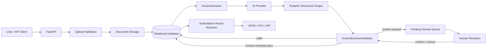

# Architecture

## System flow



## Milestone 5 review boundary

```text
AI candidate extraction
      ↓
deterministic business validation
      ├── pass   -> document status: validated
      └── issues -> document status: review_required
                        ↓
                  pending Review row
                        ↓
                  human decision
                  ├── confirm as-is
                  └── partial corrections
                        ↓
           deterministic revalidation
                        ├── fail -> review remains pending
                        └── pass -> review completed
                                   document status: reviewed
```


## Milestone 6 export boundary

```text
current document state
      ↓
latest extraction + review context
      ↓
Authoritative Result Resolver
      ├── validated -> AI values are authoritative
      ├── reviewed  -> AI values + human correction overlay
      └── any other state -> HTTP 409, do not export
      ↓
normalized final result
      ├── GET /documents/{id}/result
      ├── JSON download
      └── CSV download
```

The export layer does not recalculate business decisions. It resolves the already-approved record and serializes it for downstream use. This keeps workflow approval separate from transport format.

## Phase 2 Milestone 8 database boundary

```text
FastAPI / service layer
        ↓
SQLAlchemy ORM models
        ↓
Alembic migration history
        ↓
├── PostgreSQL  production
└── SQLite      local development / tests
```

The ORM model remains the application-facing persistence contract. Alembic now owns deployed schema evolution, and the initial migration reproduces the existing `Document`, `Extraction`, `Review`, and `LineItem` tables. `APP_ENV=production` requires a PostgreSQL URL so a production deployment cannot silently fall back to the local SQLite database.

Future model changes should be expressed as explicit migration revisions rather than by calling `Base.metadata.create_all()` against an already-deployed database.

## Candidate vs authoritative record

The original AI extraction is immutable. Human review stores only the fields the reviewer changed.

```text
Extraction row                 Review row
(original AI candidate)        (human correction overlay)
        │                              │
        └──────────────┬───────────────┘
                       ↓
             authoritative result
                       +
              per-field provenance
```

Example:

```text
AI total:      999.00
Human patch:   total = 210.00

original_extraction.total      -> 999.00
corrections.total              -> 210.00
authoritative_result.total     -> 210.00
field_sources.total            -> human
field_sources.vendor_name      -> ai
```

This preserves traceability without duplicating every unchanged field in a second invoice record.

## Responsibility boundaries

| Component | Responsibility |
|---|---|
| Document API | Upload and retrieve safe document metadata |
| Storage service | Sanitize names, validate type, enforce size, persist bytes |
| Extraction API | Coordinate AI extraction, validation, persistence, and initial workflow routing |
| InvoiceExtractor | Call the provider and require strict structured output |
| Extraction Pydantic schema | Define structurally valid invoice data |
| InvoiceBusinessValidator | Apply deterministic arithmetic, required-field, date, currency, and confidence rules |
| Review API | List pending work, show review context, accept human confirmation/corrections |
| Review schema | Constrain partial correction payloads and expose authoritative values with provenance |
| Result resolver | Select the exportable authoritative record and fail closed for incomplete workflow states |
| Result/export API | Expose final API retrieval plus JSON and line-item-oriented CSV downloads |
| Database | Preserve document metadata, AI candidate data, validation evidence, review audit data, and corrections |

## Why human corrections are revalidated

Human input is more authoritative than AI output, but it is not magically immune to typos. A reviewer could enter a total that still does not reconcile.

Therefore:

```text
human correction
      ↓
same deterministic business rules
      ↓
valid -> complete review
invalid -> HTTP 422, review stays pending
```

The only business check skipped after human review is **AI confidence**. Confidence routed the AI candidate to a person; once a person has reviewed the record, the model's self-reported uncertainty should not block that human decision.

## Review states

```text
pending      review awaits a human decision
completed    a human confirmed/corrected and revalidation passed
superseded   a later clean extraction made the old pending review obsolete
```

Document workflow states now include:

```text
uploaded
  ↓
extracting
  ├── extraction_failed
  ↓
business validation
  ├── validated
  └── review_required
          ↓
       reviewed
```

## Current limitations

- The review is document-level and resolves against the latest extraction rather than storing an explicit `extraction_id` foreign key.
- The correction overlay is exposed through the API; a dedicated review UI is optional later work.
- PostgreSQL is the production persistence target, but containerized database provisioning is deferred to Phase 2 Milestone 9.
- Bulk multi-document export is not implemented; Milestone 6 exports one authoritative document at a time.
- Webhook completion notification remains optional future work.

## Portfolio architecture graphic

The final rendered architecture is available in:

- `docs/architecture.svg` for crisp documentation/README use;
- `docs/architecture.png` for portfolio galleries and screenshots.

The diagram intentionally emphasizes the trust boundary: AI produces a candidate, deterministic rules decide whether it can pass automatically, humans resolve exceptions, and only the authoritative result is exported.
