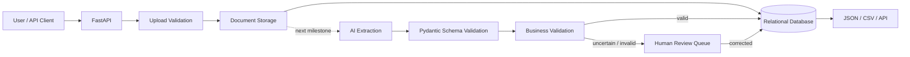

# Architecture

## System flow



## Milestone 2 request boundary

```text
UNTRUSTED INPUT                       TRUSTED APPLICATION STATE

client filename ─┐
MIME header ─────┼─> validation ─> UUID storage path ─> Document row
file bytes ──────┤
file size ───────┘
```

The important boundary is that client-provided upload metadata does not directly control where a file is stored.

## Responsibility boundaries

| Component | Responsibility |
|---|---|
| API | Receive requests, translate expected failures into HTTP responses |
| Storage service | Sanitize names, validate type, enforce size, persist bytes |
| Document schema | Define public document metadata returned by the API |
| Database session dependency | Provide one SQLAlchemy session per request |
| Database | Persist document, extraction, review, and final state |
| AI extraction | Convert unstructured content into candidate structured data |
| Pydantic validation | Enforce extraction structure and field types |
| Business validation | Enforce deterministic invoice rules |
| Human review | Resolve uncertain or invalid extractions |
| Export | Make reliable structured data available downstream |

## Upload consistency rule

A successful upload should produce both:

```text
stored file + database Document row
```

If file validation fails, neither should exist.

If the file is written but database persistence fails, the route removes the stored file. This is a small compensation step that keeps local storage and database metadata synchronized without introducing a more complex distributed transaction system.
