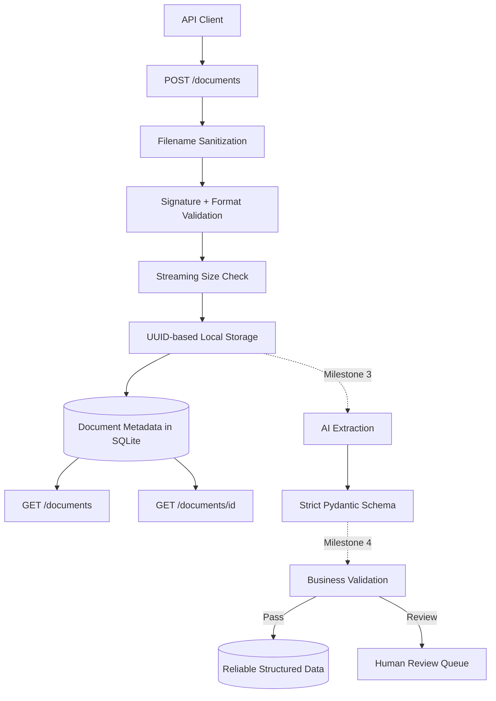

# AI Document Extraction & Human Review Pipeline

A portfolio project demonstrating production-style AI document processing with Python, FastAPI, Pydantic, SQLAlchemy, SQLite, structured extraction, deterministic validation, and human-in-the-loop review.

## Business problem

A fictional company manually copies invoice data into internal systems. Manual entry is repetitive, slow, and error-prone. This project automates extraction while preserving human oversight when the AI output is incomplete, low-confidence, or mathematically inconsistent.

## Current scope

**Milestone 2 complete: Document upload API**

Implemented so far:

- maintainable Python application structure
- environment-based configuration
- SQLAlchemy database foundation
- `Document`, `Extraction`, `LineItem`, and `Review` models
- synthetic invoice fixtures
- Mermaid architecture documentation
- `POST /documents`
- `GET /documents/{id}`
- `GET /documents`
- streamed file storage
- UUID-based stored filenames
- client-filename sanitization
- PDF, PNG, JPG, and JPEG allow-list
- file-signature validation
- extension/content consistency checks
- configurable upload-size limit
- persistent upload metadata
- automated happy-path and failure-path tests
- portfolio and learning notes

Not implemented yet:

- AI extraction
- strict Pydantic extraction schema
- business-rule validation
- human review endpoints
- export

Those are later milestones. Keeping them separate makes each layer independently understandable and testable, a rare outbreak of restraint in software development.

## Architecture



### Design principle

The uploaded file and its metadata are persisted before AI processing is introduced. This creates a stable boundary:

```text
untrusted HTTP upload
        ↓
validated stored document
        ↓
future AI processing
```

AI extraction should consume an already identified, validated document rather than being tangled into the upload request.

## Repository structure

```text
ai-document-review-pipeline/
├── app/
│   ├── api/
│   │   └── documents.py       # upload and retrieval routes
│   ├── core/
│   │   └── config.py          # environment-backed settings
│   ├── db/
│   │   ├── base.py
│   │   └── session.py         # engine, session factory, request dependency
│   ├── models/                # SQLAlchemy entities
│   ├── schemas/
│   │   └── document.py        # public document response schema
│   ├── services/
│   │   └── storage.py         # upload validation and safe persistence
│   └── main.py
├── sample_invoices/
├── scripts/
├── storage/uploads/           # runtime files; ignored by Git
├── tests/
├── .env.example
├── .gitignore
├── ARCHITECTURE.md
├── LEARNING_NOTES.md
├── PORTFOLIO_NOTES.md
├── pyproject.toml
├── requirements.txt
└── README.md
```

## Milestone 2 request flow

```text
multipart upload
     ↓
remove client-supplied path components
     ↓
read signature bytes
     ↓
verify PDF / PNG / JPEG
     ↓
verify extension + MIME consistency
     ↓
stream to storage while enforcing size limit
     ↓
write Document metadata inside DB transaction
     ↓
return API-safe metadata
```

The original filename is kept only as metadata. The actual stored filename is generated from the document UUID, so a filename supplied by a client never determines the server-side storage path.

## Supported upload formats

| Format | Extensions | Canonical MIME type |
|---|---|---|
| PDF | `.pdf` | `application/pdf` |
| PNG | `.png` | `image/png` |
| JPEG | `.jpg`, `.jpeg` | `image/jpeg` |

The application checks signature bytes instead of trusting the request header alone. This is intentionally lightweight file-type validation for the portfolio stage, not a claim that arbitrary hostile uploads are completely safe.

## API endpoints

### `POST /documents`

Uploads one document and returns persisted metadata.

Example:

```bash
curl -X POST \
  -F "file=@sample_invoices/invoice_001.png" \
  http://127.0.0.1:8000/documents
```

Example response:

```json
{
  "id": "<uuid>",
  "original_filename": "invoice_001.png",
  "content_type": "image/png",
  "file_size_bytes": 12345,
  "processing_status": "uploaded",
  "uploaded_at": "2026-09-20T00:00:00Z"
}
```

### `GET /documents/{id}`

Returns metadata for one stored document. Missing IDs return `404`.

### `GET /documents`

Returns documents newest-first. Supports:

- `limit`: 1 to 100, default 50
- `offset`: zero or greater

Example:

```bash
curl "http://127.0.0.1:8000/documents?limit=20&offset=0"
```

## Configuration

Copy the example environment file:

```bash
cp .env.example .env
```

Important settings:

```text
DATABASE_URL=sqlite:///./document_review.db
UPLOAD_DIR=storage/uploads
MAX_UPLOAD_MB=10
```

Secrets belong in `.env`, which is excluded from version control.

## Local setup

Python 3.11+ is recommended.

```bash
python -m venv .venv
source .venv/bin/activate          # macOS/Linux
# .venv\Scripts\activate          # Windows PowerShell

pip install -r requirements.txt
```

Initialize the database:

```bash
python -m scripts.init_db
```

Run the API:

```bash
uvicorn app.main:app --reload
```

Interactive API documentation is available at:

```text
http://127.0.0.1:8000/docs
```

Health check:

```text
http://127.0.0.1:8000/health
```

## Tests

```bash
pytest -q
```

Milestone 2 currently verifies:

1. safe local configuration;
2. expected database tables;
3. health endpoint;
4. successful document upload;
5. persisted file storage;
6. single-document retrieval;
7. document listing;
8. removal of client-supplied path components;
9. rejection of unsupported content;
10. rejection of extension/content mismatches;
11. upload-size enforcement;
12. `404` behavior for missing documents.

## Failure behavior

| Failure | HTTP response | Result |
|---|---:|---|
| unsupported/invalid file | `415` | nothing persisted |
| extension/content mismatch | `415` | nothing persisted |
| file above configured limit | `413` | partial file deleted |
| database persistence failure | `500` | stored file deleted |
| unknown document ID | `404` | no state change |

Cleaning up the file after a database failure prevents a common consistency bug: a file existing on disk with no corresponding database record.

## Synthetic test data

`sample_invoices/invoice_001.png` is a fake invoice suitable for upload demonstrations.

`invoice_001.json` contains expected structured values for future extraction tests.

`invoice_002_needs_review.json` deliberately contains an incorrect total. It will later prove that deterministic validation can override plausible AI output and route a document to review.

## Planned milestones

1. **Architecture and repository** — complete.
2. **Document upload API** — complete.
3. **AI extraction** — strict structured output, extraction service, retries, mocked tests.
4. **Business validation** — totals, dates, currencies, required fields, confidence.
5. **Human review queue** — review/correction APIs and authoritative corrected results.
6. **Export** — JSON, CSV, API retrieval.
7. **Portfolio polish** — screenshots, demo script, technical and business explanation.

## Security posture

- no real customer or invoice data
- no committed API keys
- runtime upload directory excluded from Git
- generated server-side filenames
- client path components stripped from original filenames
- allow-listed file formats
- signature-based content checks
- configurable upload-size limit
- partial files removed when validation/storage fails
- stored file removed if its database transaction fails

Future production hardening could add malware scanning, object storage, stricter document parsing, authentication, rate limits, and reverse-proxy request limits. They are deliberately not being added before the portfolio workflow requires them.

## Portfolio thesis

This project is not meant to prove that an LLM can read an invoice in a demo. Many demos can do that. It is meant to prove that an AI extraction workflow can be **validated, traced, corrected, and integrated into ordinary business software** without blindly trusting the model.
