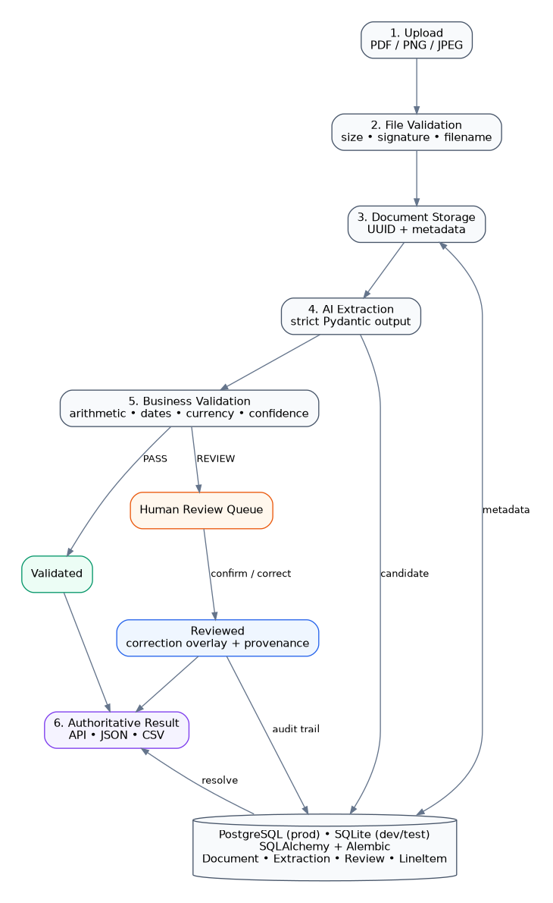
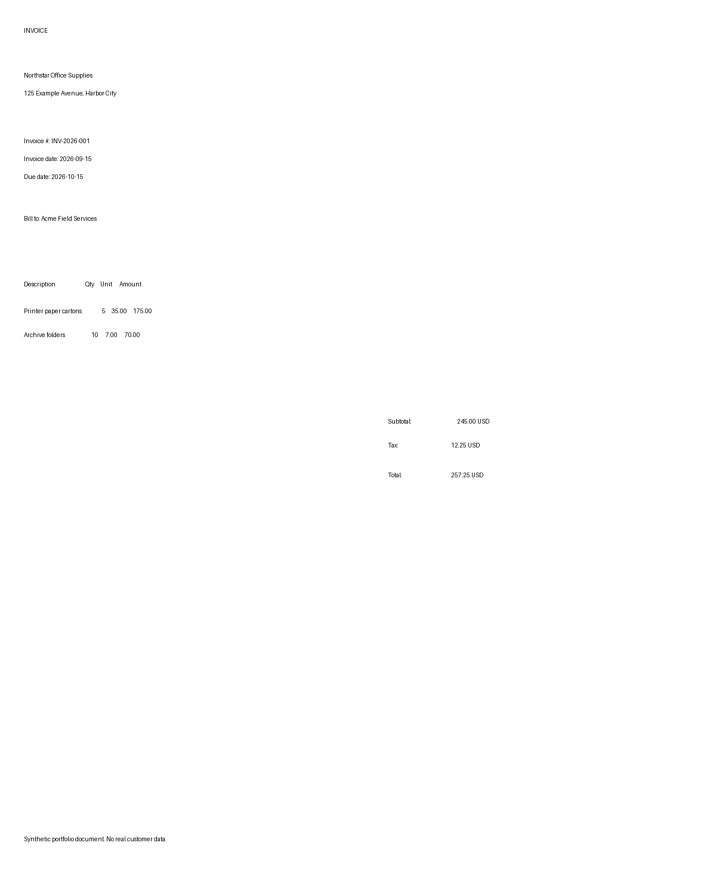
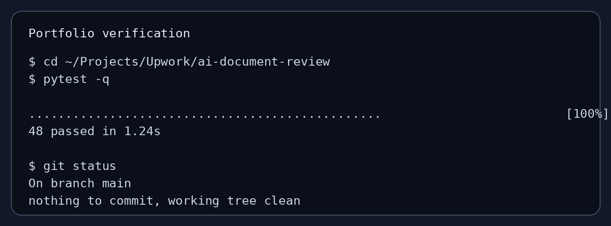

# AI Document Extraction & Human Review Pipeline

Production-style portfolio project for invoice processing with **FastAPI, Pydantic, SQLAlchemy, SQLite, multimodal AI extraction, deterministic validation, human review, and authoritative JSON/CSV export**.

The system is designed around one rule: **AI may interpret a document, but it does not get to silently promote its own output into trusted business data.**



## Project status

**Complete portfolio implementation.**

The end-to-end workflow is implemented and tested:

```text
Upload → AI extraction → deterministic validation → human review when required → authoritative JSON/CSV export
```

## What this project solves

A fictional operations team receives invoices as PDFs and images and manually keys invoice fields into internal systems. That work is repetitive and error-prone, while a fully autonomous AI workflow would create a different risk: malformed, low-confidence, or mathematically inconsistent output could move downstream without review.

This pipeline automates the routine path and explicitly routes uncertain cases to a person.

```text
PDF / image
    ↓
secure upload validation
    ↓
AI structured extraction
    ↓
Pydantic schema validation
    ↓
deterministic business rules
    ├── PASS   → validated
    └── REVIEW → human review → reviewed
                         ↓
              authoritative result
                         ↓
                  API / JSON / CSV
```

## Portfolio highlights

- validates file size, extension, MIME metadata, and actual signature bytes before AI processing;
- uses UUID-based storage names instead of trusting client filenames;
- requests strict typed invoice output instead of manually parsing loose JSON;
- separates probabilistic extraction from deterministic arithmetic/date/currency rules;
- preserves the original AI extraction when a human corrects a value;
- tracks field-level provenance as `ai` or `human`;
- blocks final export while a document is unresolved;
- mocks the AI provider in automated tests so the suite is deterministic and does not spend API credits;
- keeps the architecture intentionally small enough to explain to a client in a few minutes.

## Tech stack

- Python 3.12
- FastAPI
- Pydantic
- SQLAlchemy
- SQLite
- OpenAI structured output
- pytest
- REST / JSON
- Git

## Visual evidence

### Synthetic input invoice



### Test suite



Additional portfolio material:

- [Case study](docs/CASE_STUDY.md)
- [Two-minute demo script](docs/DEMO_SCRIPT.md)
- [Test evidence](docs/TEST_EVIDENCE.md)
- [Sample AI extraction](docs/sample_extracted_invoice.json)
- [Sample reviewed authoritative result](docs/sample_reviewed_result.json)
- [Sample CSV export](docs/sample_export.csv)
- [Screenshot guide](docs/SCREENSHOT_GUIDE.md)
- [Detailed architecture notes](ARCHITECTURE.md)
- [Learning notes](LEARNING_NOTES.md)

## Core API

| Endpoint | Purpose |
| --- | --- |
| `POST /documents` | Upload and validate PDF/PNG/JPEG documents |
| `GET /documents` | List uploaded documents |
| `GET /documents/{id}` | Retrieve document metadata |
| `POST /documents/{id}/extractions` | Run AI extraction and business validation |
| `GET /documents/{id}/extractions/latest` | Read the latest extraction candidate |
| `GET /reviews` | List review work |
| `GET /reviews/{document_id}` | Inspect AI values, review reason, and current authoritative view |
| `POST /reviews/{document_id}` | Confirm or correct a flagged extraction |
| `GET /documents/{id}/result` | Retrieve final authoritative data |
| `GET /documents/{id}/exports/json` | Download authoritative JSON |
| `GET /documents/{id}/exports/csv` | Download line-item-oriented CSV |
| `GET /health` | Health check |

Interactive API documentation is available at `/docs` while the application is running.

## Invoice fields

The structured extraction includes:

- invoice number and dates;
- vendor and customer information;
- subtotal, tax, total, and ISO currency code;
- line items with description, quantity, unit price, and amount;
- AI confidence score.

## Validation rules

Pydantic first verifies structure and types. A separate `InvoiceBusinessValidator` then checks business invariants, including:

- required invoice number/vendor/total/currency fields;
- `subtotal + tax ≈ total`;
- line-item sum ≈ subtotal;
- `quantity × unit_price ≈ amount` per line item;
- valid ISO 4217 currency codes;
- sensible invoice/due-date ordering;
- configurable AI confidence threshold.

Validation failures are stored as structured issues containing a code, field, message, observed value, and expected value. They route the document to review rather than discarding it.

## Human review model

The review layer uses an **overlay**, not destructive editing.

```text
immutable AI extraction
        +
human correction overlay
        ↓
authoritative result
```

If AI extracted `total = 999.00` and a reviewer corrects only `total = 210.00`, the final result uses `210.00`, while the original `999.00` remains available for audit. `field_sources` marks `total` as human and untouched fields as AI.

A reviewer may also submit an empty correction object to confirm a low-confidence extraction as-is.

## Export safety

Only documents in `validated` or `reviewed` state can be exposed as final data. Pending, failed, or unresolved documents return HTTP `409` from the authoritative result/export endpoints.

This prevents an uncertain AI candidate from quietly escaping into downstream accounting or reporting systems, which is the sort of tiny omission that becomes a very expensive meeting later.

## Local setup

Requirements: Python 3.11+.

```bash
cd ai-document-review
python -m venv .venv
source .venv/bin/activate
pip install -r requirements.txt
cp .env.example .env
python -m scripts.init_db
uvicorn app.main:app --reload
```

Open:

```text
http://127.0.0.1:8000/docs
```

For live AI extraction, set a document-capable model and API key in `.env`:

```text
AI_PROVIDER="openai"
AI_MODEL="<document-capable-model>"
AI_API_KEY="<your-api-key>"
```

Never commit the real `.env` file.

## Quick demo

Upload the included synthetic invoice:

```bash
curl -X POST \
  -F "file=@sample_invoices/invoice_001.png" \
  http://127.0.0.1:8000/documents
```

Or run:

```bash
./scripts/demo_commands.sh
```

Then use the returned document ID in `/docs` to run extraction, inspect validation, review if needed, and export the authoritative result. The full presentation sequence is in [docs/DEMO_SCRIPT.md](docs/DEMO_SCRIPT.md).

## Tests

```bash
pytest -q
```

Current portfolio baseline:

```text
48 passed
```

The tests cover upload security, schemas, database structure, mocked AI extraction, retry/failure behavior, deterministic business validation, review workflows, provenance, final result resolution, and export gating.

## Repository structure

```text
ai-document-review/
├── app/
│   ├── api/                 # HTTP routes
│   ├── core/                # environment configuration
│   ├── db/                  # engine/session foundation
│   ├── models/              # SQLAlchemy entities
│   ├── schemas/             # Pydantic request/response contracts
│   └── services/            # storage, extraction, validation, result logic
├── docs/                    # portfolio case study, visuals, samples, demo material
├── sample_invoices/         # synthetic document fixtures
├── scripts/                 # database init and demo helper
├── tests/                   # automated unit/integration tests
├── .env.example
├── ARCHITECTURE.md
├── LEARNING_NOTES.md
├── PORTFOLIO_NOTES.md
├── pyproject.toml
├── requirements.txt
└── README.md
```

## Business-value model

For portfolio demonstration, assume manual entry takes 4 minutes per invoice and the automated workflow averages 30 seconds of human attention per invoice after exception handling/spot checks.

At 1,000 invoices per month, that illustrative model reduces staff effort from roughly **66.7 hours to 8.3 hours**, or about **58.4 hours saved per month**.

This is an illustrative estimate, not a measured production result. Real savings depend on invoice complexity, review rate, provider latency, and the client's current process. See the [case study](docs/CASE_STUDY.md) for the assumptions.

## Design choices and tradeoffs

### SQLite first

SQLite keeps the portfolio demo self-contained. SQLAlchemy keeps the persistence boundary clean enough to move to PostgreSQL later.

### Local filesystem first

Local storage avoids infrastructure that adds little portfolio value. Production deployment should use object storage such as S3.

### Deterministic rules outside the LLM

Arithmetic, dates, currencies, and workflow state are ordinary software problems. Delegating them to a language model would add cost and uncertainty without adding value.

### API-driven review instead of a frontend

The backend workflow is the portfolio focus. A review dashboard would improve usability but is intentionally left as a future enhancement rather than bloating the first version.

## Security and limitations

Implemented safeguards:

- environment variables for secrets;
- synthetic documents only;
- upload size and format restrictions;
- file-signature verification;
- server-generated storage names;
- no confidential document body logging by design;
- final-export gating.

Known limitations:

- no authentication/RBAC;
- no PostgreSQL/Alembic migration setup yet;
- local filesystem storage only;
- no dedicated review UI;
- no batch processing/export;
- provider smoke tests are not part of the default offline test suite.

## Portfolio status

**Complete portfolio implementation.**

The repository demonstrates the complete end-to-end workflow:

```text
Upload → AI extraction → deterministic validation → human review when required → authoritative JSON/CSV export
```

The project is built for freelance/Upwork demonstrations: recognizable business problem, explainable architecture, visible reliability controls, failure-path tests, and a short demo path rather than a feature-count contest.
