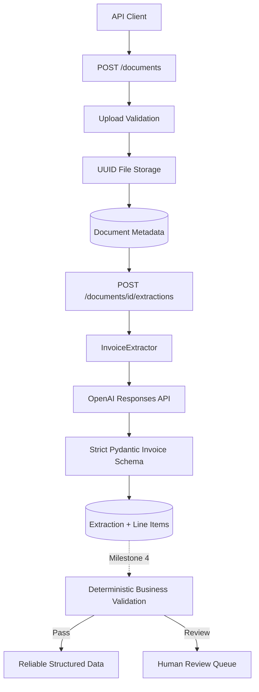

# AI Document Extraction & Human Review Pipeline

A portfolio project demonstrating production-style AI document processing with Python, FastAPI, Pydantic, SQLAlchemy, SQLite, structured AI extraction, deterministic validation, and human-in-the-loop review.

## Business problem

A fictional company manually copies invoice data into internal systems. Manual entry is repetitive, slow, and error-prone. This project automates extraction while preserving human oversight when the AI output is incomplete, low-confidence, or mathematically inconsistent.

## Current scope

**Milestone 3 complete: AI extraction**

Implemented so far:

- maintainable Python/FastAPI application structure
- environment-based configuration
- SQLAlchemy database foundation
- `Document`, `Extraction`, `LineItem`, and `Review` models
- synthetic invoice fixtures
- safe PDF/PNG/JPEG upload and local storage
- UUID-based document identity
- upload size and file-signature validation
- `POST /documents`, `GET /documents/{id}`, and `GET /documents`
- strict Pydantic schema for AI invoice output
- OpenAI Responses API adapter for image and PDF inputs
- structured-output parsing instead of manual JSON parsing
- configurable retry limit for provider/structured-output failures
- persisted extraction metadata and line items
- `POST /documents/{id}/extractions`
- `GET /documents/{id}/extractions/latest`
- mocked AI tests with no live API calls
- portfolio and learning notes

Not implemented yet:

- deterministic invoice business-rule validation
- automatic review routing
- human review endpoints
- export

Those remain separate milestones so structural AI validation is not confused with deterministic business rules.

## Architecture



### Current trust boundary

```text
untrusted document
      ↓
upload validation
      ↓
stored document
      ↓
probabilistic AI extraction
      ↓
strict Pydantic structure validation
      ↓
persisted candidate extraction
      ↓
Milestone 4: deterministic business validation
```

The model is allowed to interpret the document. It is not allowed to define the application's data contract.

## Repository structure

```text
ai-document-review-pipeline/
├── app/
│   ├── api/
│   │   ├── documents.py       # upload and document retrieval
│   │   └── extractions.py     # run/retrieve AI extraction
│   ├── core/
│   │   └── config.py
│   ├── db/
│   ├── models/
│   ├── schemas/
│   │   ├── document.py
│   │   └── extraction.py      # strict AI + API schemas
│   ├── services/
│   │   ├── storage.py
│   │   └── extraction.py      # provider adapter + retry behavior
│   └── main.py
├── sample_invoices/
├── scripts/
├── storage/uploads/
├── tests/
├── .env.example
├── ARCHITECTURE.md
├── LEARNING_NOTES.md
├── PORTFOLIO_NOTES.md
├── pyproject.toml
├── requirements.txt
└── README.md
```

## API workflow

### 1. Upload an invoice

```bash
curl -X POST \
  -F "file=@sample_invoices/invoice_001.png" \
  http://127.0.0.1:8000/documents
```

The response contains a document UUID. The stored file has already passed the Milestone 2 upload checks.

### 2. Extract invoice data

```bash
curl -X POST \
  http://127.0.0.1:8000/documents/<DOCUMENT_ID>/extractions
```

The extraction endpoint:

1. marks the document `extracting`;
2. sends the stored PDF/image to the configured AI model;
3. requires output matching `InvoiceExtractionPayload`;
4. retries provider/structured-output failures up to `AI_MAX_ATTEMPTS`;
5. persists the extraction and line items;
6. marks the document `extracted`;
7. returns the persisted structured result.

If all attempts fail, the document becomes `extraction_failed` and the API returns `502`. Missing AI configuration returns `503`.

### 3. Read the latest extraction

```bash
curl \
  http://127.0.0.1:8000/documents/<DOCUMENT_ID>/extractions/latest
```

## Strict extraction schema

The AI is asked for these invoice fields:

```text
invoice_number
invoice_date
vendor_name
vendor_address
customer_name
subtotal
tax
total
currency
due_date
line_items[]
confidence
```

Each line item requires:

```text
description
quantity
unit_price
amount
```

Pydantic rejects unexpected fields, invalid dates, negative numeric values, malformed line items, and confidence outside `0..1`. Currency is normalized to uppercase. Whether a currency code is actually valid ISO currency, or whether totals mathematically reconcile, belongs to Milestone 4.

## AI-provider boundary

`app/services/extraction.py` is the only component that knows how the provider request is constructed.

For PNG/JPEG it sends a base64 `input_image`. For PDF it sends a base64 `input_file`. The service requests typed structured output using the Pydantic extraction model.

The rest of the application receives an `AIExtractionResult`, not arbitrary provider JSON. This keeps the API and database layers insulated from provider-specific response objects.

## Configuration

Copy the example file:

```bash
cp .env.example .env
```

Configure at least:

```text
DATABASE_URL=sqlite:///./document_review.db
UPLOAD_DIR=storage/uploads
MAX_UPLOAD_MB=10
AI_PROVIDER=openai
AI_MODEL=<document-capable-model>
AI_API_KEY=<your-api-key>
AI_MAX_ATTEMPTS=2
```

Never commit `.env` or a real API key.

## Local setup

Python 3.11+ is recommended.

```bash
python -m venv .venv
source .venv/bin/activate
pip install -r requirements.txt
python -m scripts.init_db
uvicorn app.main:app --reload
```

Interactive documentation:

```text
http://127.0.0.1:8000/docs
```

## Tests

```bash
pytest -q
```

Milestone 3 adds coverage for:

- strict invoice schema validation;
- currency normalization;
- rejection of unexpected AI fields;
- image input construction;
- PDF input construction;
- retry-then-success behavior;
- exhausted retry behavior;
- extraction persistence;
- line-item persistence;
- extraction status transitions;
- latest-extraction retrieval;
- mocked provider failure.

The test suite does **not** call a live AI API. Provider behavior is mocked so tests remain fast, deterministic, and free of API cost.

## Milestone boundary

Milestone 3 answers:

> Can the system turn a stored invoice into structurally valid candidate data and preserve it reliably?

Milestone 4 will answer:

> Is that candidate data internally consistent and safe to accept automatically?

Keeping those questions separate is important. An AI response can be perfectly valid JSON and still contain a mathematically wrong invoice total.
