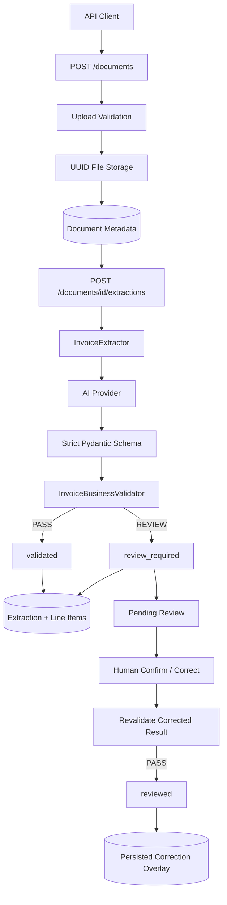

# AI Document Extraction & Human Review Pipeline

A portfolio project demonstrating production-style AI document processing with Python, FastAPI, Pydantic, SQLAlchemy, SQLite, structured AI extraction, deterministic business validation, and human-in-the-loop review.

## Business problem

A fictional company manually copies invoice data into internal systems. Manual entry is repetitive, slow, and error-prone. This project automates extraction while preserving human oversight when the AI output is incomplete, low-confidence, or mathematically inconsistent.

## Current scope

**Milestone 5 complete: human review queue and authoritative corrections**

Implemented so far:

- maintainable Python/FastAPI application structure
- environment-based configuration
- SQLAlchemy database foundation
- `Document`, `Extraction`, `LineItem`, and `Review` models
- synthetic invoice fixtures
- safe PDF/PNG/JPEG upload and local storage
- UUID-based document identity
- upload size and file-signature validation
- `POST /documents`, `GET /documents/{id}`, and `GET /documents`
- strict Pydantic schema for AI invoice output
- OpenAI Responses API adapter for image and PDF inputs
- structured-output parsing instead of manual JSON parsing
- configurable retry limit for provider/structured-output failures
- persisted extraction metadata and line items
- deterministic invoice business validation
- configurable confidence and monetary tolerance thresholds
- ISO 4217 currency-code checking
- structured validation errors persisted with each extraction
- automatic `validated` vs `review_required` routing state
- automatic creation of pending review work for flagged invoices
- `GET /reviews`, `GET /reviews/{document_id}`, and `POST /reviews/{document_id}`
- partial human correction overlays plus confirm-as-is review decisions
- revalidation of human-corrected data before completion
- immutable original AI extraction alongside persisted human corrections
- authoritative merged result with per-field `ai` vs `human` provenance
- reviewer identity and correction timestamp audit fields
- mocked AI tests with no live API calls
- portfolio and learning notes

Not implemented yet:

- JSON/CSV export
- optional review dashboard UI

Those remain separate milestones so the review workflow stays focused on auditability and correctness before downstream export is added.

## Architecture



### Trust boundary

```text
untrusted document
      ↓
upload validation
      ↓
stored document
      ↓
probabilistic AI extraction
      ↓
strict Pydantic structure validation
      ↓
deterministic business validation
      ├── pass   -> validated
      └── issues -> review_required -> human review
                                      ↓
                         confirm or correct fields
                                      ↓
                         deterministic revalidation
                                      ↓
                                   reviewed
```

The model interprets the document. Python decides whether the candidate can be accepted automatically. A human can then confirm or correct flagged data without overwriting the original AI record.

## Repository structure

```text
ai-document-review-pipeline/
├── app/
│   ├── api/
│   │   ├── documents.py
│   │   ├── extractions.py
│   │   └── reviews.py
│   ├── core/
│   │   └── config.py
│   ├── db/
│   ├── models/
│   ├── schemas/
│   │   ├── document.py
│   │   ├── extraction.py
│   │   └── review.py
│   ├── services/
│   │   ├── storage.py
│   │   ├── extraction.py
│   │   └── validation.py
│   └── main.py
├── sample_invoices/
├── scripts/
├── storage/uploads/
├── tests/
├── .env.example
├── ARCHITECTURE.md
├── LEARNING_NOTES.md
├── PORTFOLIO_NOTES.md
├── pyproject.toml
├── requirements.txt
└── README.md
```

## API workflow

### 1. Upload an invoice

```bash
curl -X POST \
  -F "file=@sample_invoices/invoice_001.png" \
  http://127.0.0.1:8000/documents
```

### 2. Extract and validate invoice data

```bash
curl -X POST \
  http://127.0.0.1:8000/documents/<DOCUMENT_ID>/extractions
```

The endpoint now performs two different kinds of validation:

1. **Structural validation:** Pydantic checks types, dates, allowed fields, numeric ranges, and line-item shape.
2. **Business validation:** ordinary Python checks whether the structurally valid data makes business sense.

A successful extraction therefore does **not** automatically mean the invoice is trusted.

### 3. Read the latest extraction

```bash
curl \
  http://127.0.0.1:8000/documents/<DOCUMENT_ID>/extractions/latest
```

The response includes:

```json
{
  "review_required": false,
  "validation_errors": []
}
```

An inconsistent invoice can instead return:

```json
{
  "review_required": true,
  "validation_errors": [
    {
      "code": "invoice_total_mismatch",
      "field": "total",
      "message": "Subtotal plus tax does not approximately equal total.",
      "observed": "999.00",
      "expected": "210.00"
    }
  ]
}
```

The original AI extraction remains persisted even when review is required. The review workflow stores only the human correction overlay, so the AI candidate remains available for audit.

### 4. List the pending review queue

```bash
curl http://127.0.0.1:8000/reviews
```

Use `?status=completed`, `?status=superseded`, or `?status=all` to inspect other review states.

### 5. Inspect one review

```bash
curl \
  http://127.0.0.1:8000/reviews/<DOCUMENT_ID>
```

The detail response contains three distinct views:

- `original_extraction`: immutable AI candidate data;
- `corrections`: only fields explicitly confirmed as corrections by the reviewer;
- `authoritative_result`: the merged result clients should use after review, plus `field_sources` showing whether each field came from AI or human input.

### 6. Submit a correction

```bash
curl -X POST \
  -H "Content-Type: application/json" \
  -d '{
    "corrected_by": "reviewer@example.com",
    "corrections": {
      "total": 210.00
    }
  }' \
  http://127.0.0.1:8000/reviews/<DOCUMENT_ID>
```

An empty `corrections` object means the human reviewed the invoice and confirmed the AI values as-is. Human-corrected data is run through business validation again. AI confidence is not rechecked after a human decision because confidence is a model-routing signal, not a property of the human-confirmed record.

## Authoritative-record strategy

The project deliberately does **not** overwrite the original `Extraction` row. Instead:

```text
immutable AI extraction
        +
persisted human correction overlay
        =
authoritative reviewed result
```

This keeps both values available for audit while avoiding duplicated copies of unchanged fields. `field_sources` makes provenance explicit at read time.

## Business validation rules

`InvoiceBusinessValidator` currently checks:

- required auto-accept fields are present;
- at least one line item exists;
- currency is an assigned transactional ISO 4217 code;
- AI confidence meets `AI_CONFIDENCE_THRESHOLD`;
- due date is not earlier than invoice date;
- `subtotal + tax` approximately equals `total`;
- each line item's `quantity × unit_price` approximately equals its `amount`;
- line-item amounts approximately sum to `subtotal`.

Money comparisons use decimal arithmetic and a configurable tolerance instead of exact floating-point equality.

## Processing states

```text
uploaded
   ↓
extracting
   ├── provider/schema failure -> extraction_failed
   ↓
AI candidate extracted
   ↓
business validation
   ├── no issues -> validated
   └── issues    -> review_required
                       ↓
                 pending review
                       ↓
              human confirm/correct
                       ↓
                 revalidation
                       ↓
                    reviewed
```

A later re-extraction that passes validation can mark an obsolete pending review as `superseded`, preventing stale work from remaining in the default queue.

## Configuration

Copy the example file:

```bash
cp .env.example .env
```

Configure as needed:

```text
DATABASE_URL=sqlite:///./document_review.db
UPLOAD_DIR=storage/uploads
MAX_UPLOAD_MB=10
AI_PROVIDER=openai
AI_MODEL=<document-capable-model>
AI_API_KEY=<your-api-key>
AI_MAX_ATTEMPTS=2
AI_CONFIDENCE_THRESHOLD=0.80
AMOUNT_TOLERANCE=0.01
```

Never commit `.env` or a real API key.

## Local setup

Python 3.11+ is recommended.

```bash
python -m venv .venv
source .venv/bin/activate
pip install -r requirements.txt
python -m scripts.init_db
uvicorn app.main:app --reload
```

Interactive documentation:

```text
http://127.0.0.1:8000/docs
```

## Tests

```bash
pytest -q
```

Milestone 5 adds tests for:

- automatic creation of pending reviews for flagged invoices;
- queue filtering by review status;
- review detail with original AI values and structured reasons;
- partial human corrections becoming authoritative;
- preservation of the original AI extraction after correction;
- per-field `ai`/`human` provenance;
- persistence of reviewer and correction timestamp;
- rejection of human corrections that still violate business rules;
- confirm-as-is review for low-confidence but otherwise valid invoices;
- prevention of duplicate review completion.

The suite still uses mocked AI responses, so automated tests do not call a live provider.

## Milestone boundary

Milestone 5 answers:

> Can a human review or correct flagged documents, can the system revalidate that decision, and can downstream consumers distinguish original AI values from authoritative human-reviewed values?

Milestone 6 will add JSON/CSV export of the final authoritative information.
